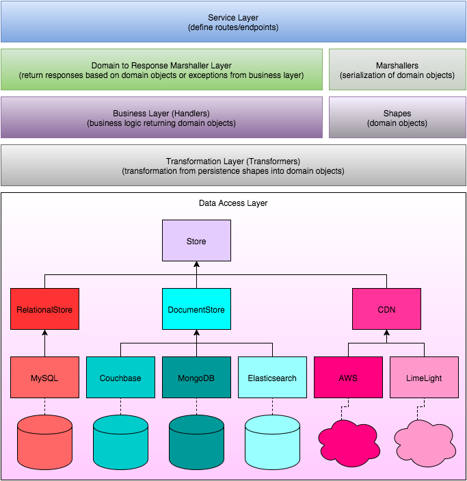

## simple-sample-akka-http-rest-service (phone number validation service)



### Framework

The service is built using [Akka HTTP](http://doc.akka.io/docs/akka-stream-and-http-experimental/current/scala/http/index.html)

### Build

We use [sbt](http://www.scala-sbt.org) as our build tool

### Run

The following command will run the service

```
$ sbt run
```